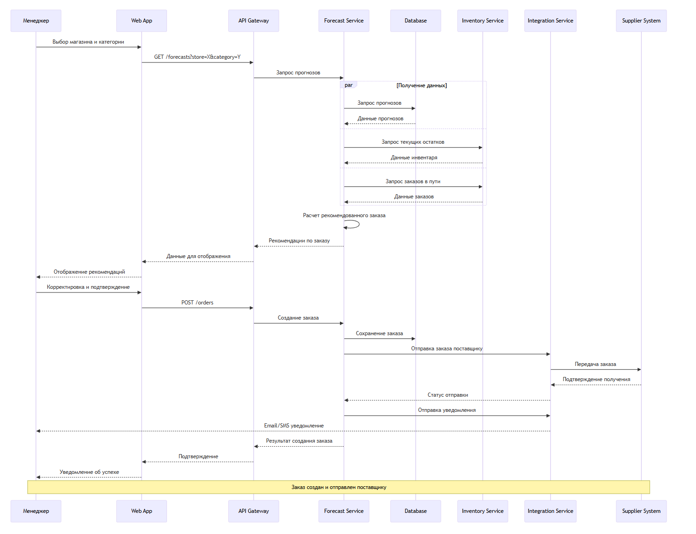

**Диаграмма последовательности:**

**Сценарий "Создание заказа на основе прогноза":**
Менеджер категории заходит в веб-приложение и выбирает интересующий его магазин и категорию товаров. Веб-приложение отправляет запрос к API Gateway, который перенаправляет запрос к Forecast Service. Сервис прогнозирования обращается к базе данных за актуальными прогнозами и текущими остатками товаров. Параллельно сервис получает информацию о текущих заказах в пути от Inventory Service. На основе полученных данных рассчитывается рекомендуемое количество для заказа с учетом страхового запаса и сроков поставки. Результат возвращается менеджеру через веб-интерфейс. Менеджер может скорректировать количества и подтверждает заказ. Подтвержденный заказ отправляется в систему управления поставщиками через Integration Service, который также обновляет статус заказа в основной системе и отправляет уведомление о создании заказа.