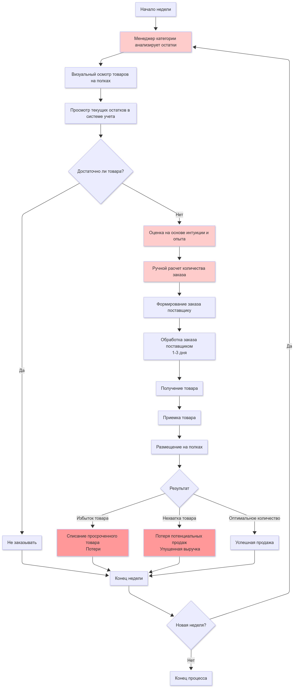
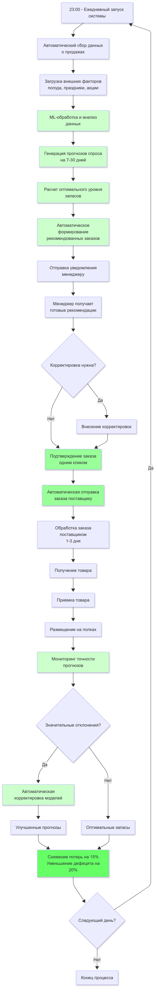

## Трансформация процесса принятия решений
### До внедрения (AS-IS):
  
Субъективность: Решения основаны на интуиции и личном опыте менеджера  
Ручной анализ: Визуальный осмотр полок и ручной просмотр остатков  
Реактивный подход: Анализ проводится только раз в неделю  
Высокий риск ошибок: Человеческий фактор в расчетах  

### После внедрения (TO-BE):  
  
Объективность: Решения на основе данных и ML-алгоритмов  
Автоматизация: Система сама собирает и анализирует данные  
Проактивный подход: Ежедневное прогнозирование на 7-30 дней вперед  
Минимизация ошибок: Автоматические расчеты с высокой точностью  

### Изменение периодичности и качества планирования

**Было**: Еженедельное планирование → **Стало**: Ежедневное прогнозирование  
**Было**: Учет только текущих остатков → **Стало**: Комплексный анализ:

**Новый элемент**: Непрерывный мониторинг точности прогнозов и автоматическая корректировка моделей, что обеспечивает постоянное улучшение качества прогнозирования.  

## Измеримые бизнес-результаты  

### Система трансформирует неконтролируемые потери в управляемые процессы:  

- Снижение потерь от просроченных товаров на 15%  
- Уменьшение случаев отсутствия товара на 20%  
- Экономия времени менеджеров на 50%  

Таким образом, информационная система кардинально меняет подход к управлению запасами: от реактивного ручного планирования к проактивному автоматизированному прогнозированию с постоянным самообучением.