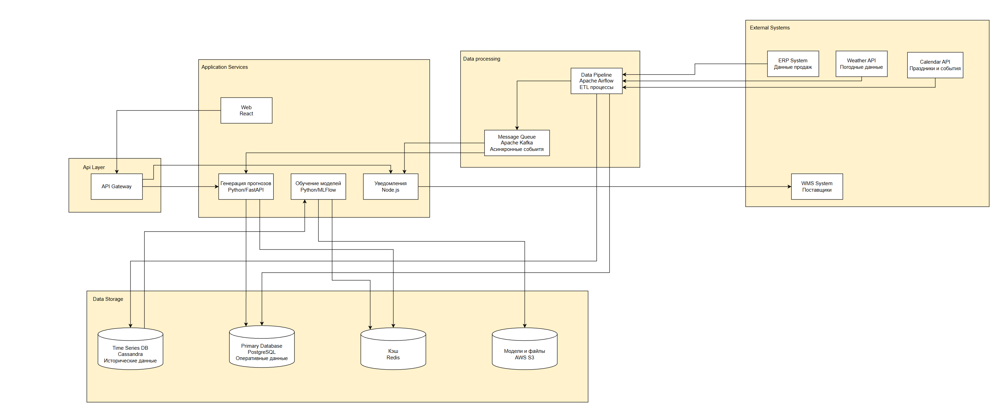

**Внешние системы:**
- ERP система (источник данных о продажах и остатках)
- Система управления поставщиками (отправка заказов)
- Weather API (данные о погоде)
- Calendar API (праздники и события)

**Контейнеры системы:**
- **Web Application** (React.js) - пользовательский интерфейс для менеджеров
- **API Gateway** (Kong) - маршрутизация запросов и аутентификация
- **Forecast Service** (Python/FastAPI) - основной сервис прогнозирования
- **Data Pipeline** (Apache Airflow) - ETL процессы
- **ML Training Service** (Python/MLflow) - обучение моделей
- **Notification Service** (Node.js) - отправка уведомлений
- **Primary Database** (PostgreSQL) - оперативные данные
- **Time Series Database** (Cassandra) - исторические данные продаж
- **Cache** (Redis) - кэширование часто используемых данных
- **Object Storage** (AWS S3) - хранение моделей и больших файлов
- **Message Queue** (Apache Kafka) - асинхронная обработка событий

**Распределенное хранение данных обусловлено:**
- Большим объемом исторических данных (2.67 млрд транзакций)
- Необходимостью быстрого доступа к оперативным данным
- Различными паттернами использования (OLTP vs OLAP)
- Требованиями к масштабируемости и производительности