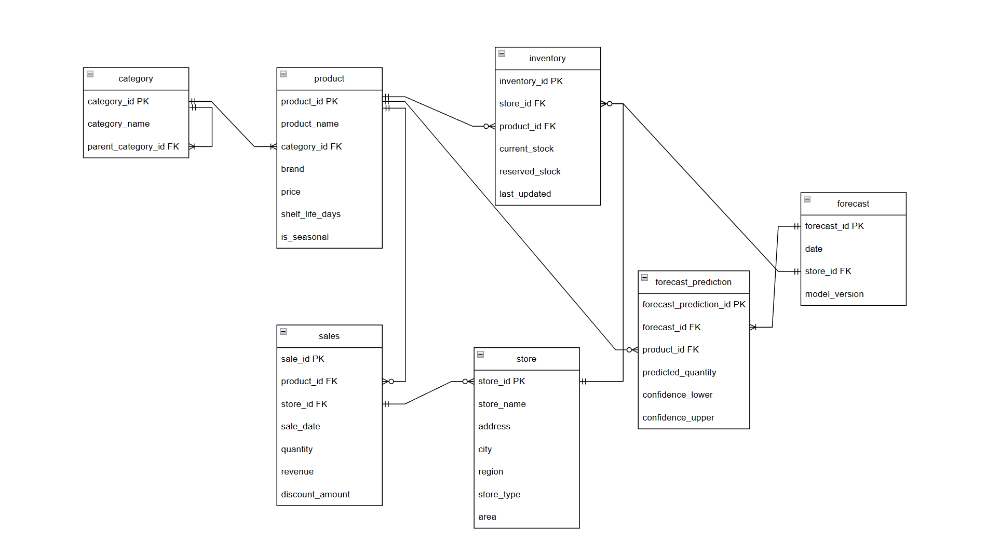

## Структура базы данных для разработки и поддержки

**Хранение данных:**
- **PostgreSQL** - основная OLTP база для операционных данных
- **Apache Cassandra** - хранение исторических данных продаж
- **Redis** - кэширование прогнозов и сессий пользователей
- **S3** - хранение моделей ML и архивных данных